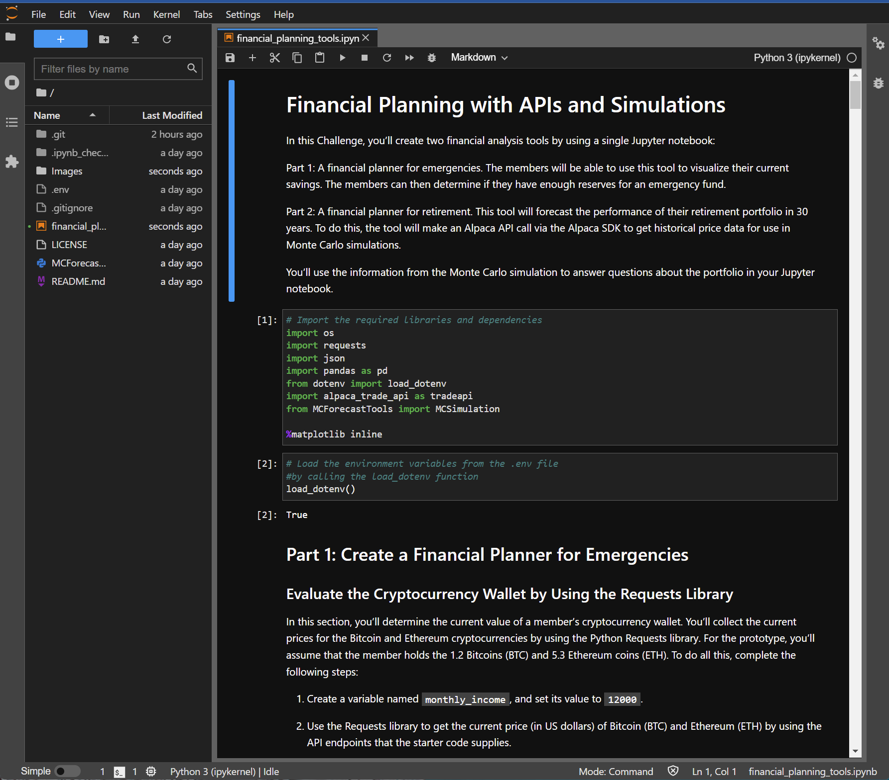

A jupyter notebook outlining a budget for emergency funds and planning for retirement.

# Financial Planner & Budgeting for Retirement


An example of a retirement planning and budgeting plan summarized in a Jupyter notebook.  Analyzes the current value of a portfolio using API requests for last trading day pricing data.  The assets considered include the crypto assets of BTC and ETH, the stock index SPY, and the bond index AGG.  After valuing the total portfolio, the notebook projects the expected cumulative returns of the stock/bond portion of the portfolio using a Monte Carlo Simulation for 30 and 10 years.     

---
## Technologies

This project is written using a ```Jupyter Lab 3.2.1``` notebook running  ```Python 3.7.11```.  Key libraries include ```pandas 1.3.5``` for importing and analyzing the data from API requests,```matplotlib 3.5.0``` for plotting the data, ```json5 0.9.6``` for storing requests from APIs, ```python-dotenv 0.20.0``` for loading environment private API keys, ```alpaca_trade_api-python``` ([Alpaca trade API](https://github.com/alpacahq/alpaca-trade-api-python/)) for retrieving stock/bond historical price information, and ```MCForecastTools.py``` ([vmieres/Personal-Finance-Planer-Retirement-Planing](https://github.com/vmieres/Personal-Finance-Planer-Retirement-Planing/blob/main/MCForecastTools.py) for performing the Monte Carlo simulations.

---

## Installation Guide

Before running the application, first install the following packages if you don't already have them installed in your development environment.

```python
  pip install jupyterlab
```
After installation, ```cd``` into the top folder of the repository.  Then open ```Jupyter Lab``` by typing:
```python
jupyter lab
```
In order to setup the environment to load private API keys, the ```python-dotenv``` library also needs to be installed.  This can be installed in the terminal with the following:
```python
pip install python-dotenv
```

The Alpaca SDK stock trading API must also be installed.  This can also be installed on the terminal by the following command:
```python
pip install alpaca-trade-api
```

In a standard install of anaconda, the ```Requests``` and ```JSON``` libraries are already installed.

Finally, you must obtain both an API key and secret key from Alpaca to access their API endpoints.  This can be done by visiting Alpaca's website at: [https://alpaca.markets/](https://alpaca.markets/).  Simply sign up for an account and save your API key and secret key to a private local folder on your desktop.  These keys will later be imported into an ```.env``` file to be used in the Alpaca SDK.


The report and analysis are in the jupyter notebook file named ```financial_planning_tools.ipynb```.  Copy your keys to a new ```.env``` file as:
```python
###Alpaca
ALPACA_API_KEY = ****
ALPACA_SECRET_KEY = ****
```
, where the **** represent your API and secret key values you obtained when signing up with Alpaca.

---

## Usage

This Jupyter notebook is intended as a guide for determining the value of an investment portfolio using the most updated values from the market.  It also takes historical market data to project a simulated estimate for future performance using a Monte Carlo simulation.

To view the jupyter notebook used in this analysis, open up a gitbash or terminal in the top folder of the cloned repository.  Open the ```financial_planning_tools.ipynb``` file, which should look like the displayed version below:



Next, make sure to create a new ```.env``` file in the same top directory as the ```financial_planning_tools.ipynb```.  Add your Alpaca API key and Alpaca secret key to the blank ```.env``` file and then save it.  

After setting up the ```.env``` file, then simply run the Kernel and the results/analysis will populate the report.

## Data Sources

The data used in this report is obtained using API requests from two sources.  
1) For the bitcoin and ethereum price information, the request is made to the free API offered by ```alternative.me```.  Documentation can be found at the following web address:
[https://alternative.me/crypto/api/](https://alternative.me/crypto/api/).

2) For the equity price data (both current and historical), the Alpaca SDK is used.  The documentation for the Alpaca SDK can be found at the following address:

[https://alpaca.markets/docs/clients/](https://alpaca.markets/docs/clients/).

---

## Contributors

The seed code is from the course material from a UCBerkeley Extension program.  This analysis is written and performed by John Gruenewald.<br><br>
For more information, contact **John Gruenewald**:<br>
**e-mail:** [john.h.gruenewald@gmail.com](mailto:john.h.gruenewald@gmail.com)<br> **linked-in:**  [jhgruenewald](https://www.linkedin.com/in/jhgruenewald/)<br>**twitter:**  [@GruenewaldJohn](https://twitter.com/GruenewaldJohn)<br>**medium:**  [@comput99](https://medium.com/@comput99)

---

## License

MIT License

Copyright (c) 2022 John Gruenewald
